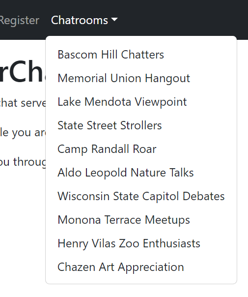
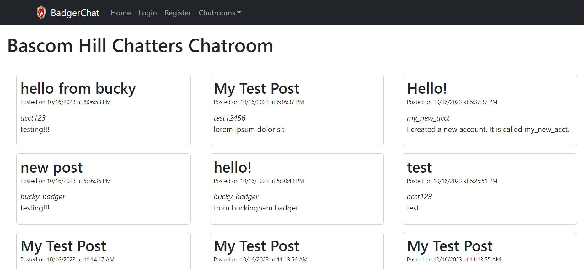
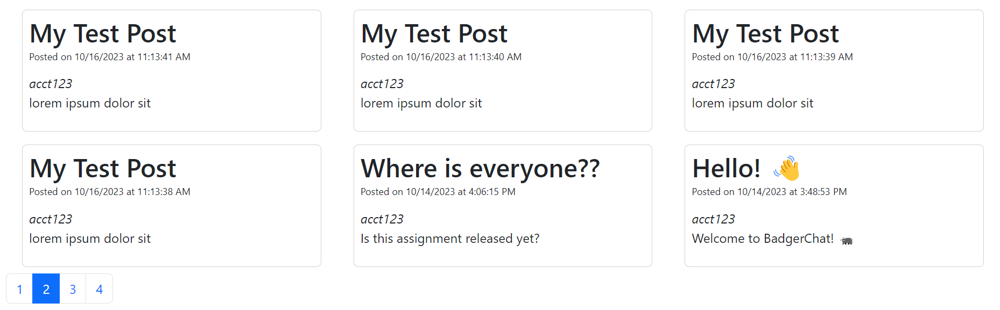
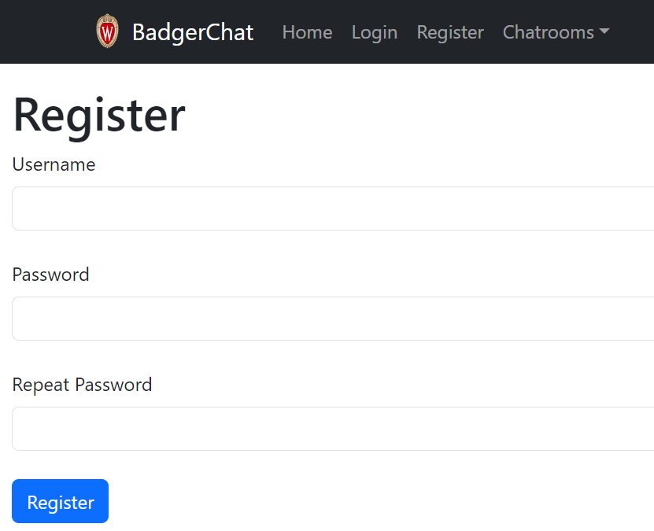
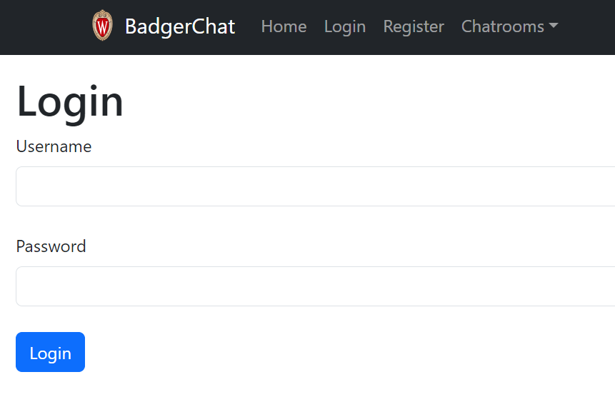
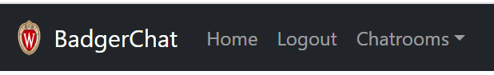
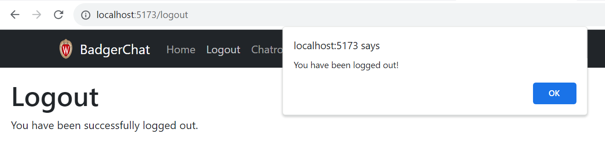
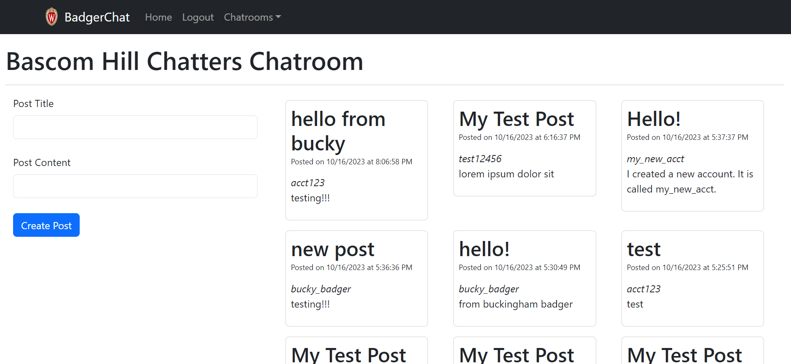
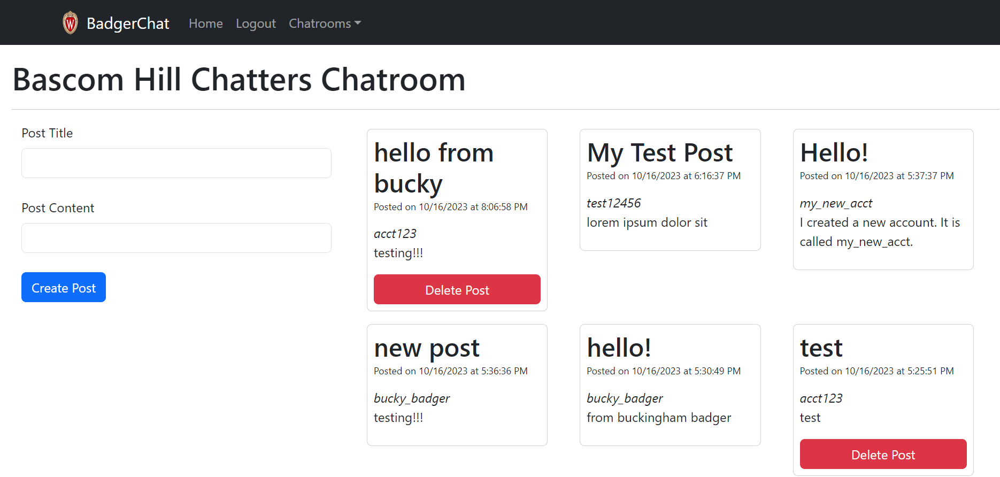

# CS571-S26 HW6: BadgerChat

Welcome to BadgerChat! This is your final React assignment that serves as a cumulative assessment of your knowledge and understanding of React. Understanding of React will be crucial for beginning with React Native.

For this assignment, you will complete a web application that allows badgers to chat with other badgers via different chatrooms. This assignment works with a *real* API! Please be mindful about what you post as this is a chat server shared by every student in CS571.

## BadgerChat

The starter code provided to you was generated using [vite](https://vitejs.dev/guide/). Furthermore, [bootstrap](https://www.npmjs.com/package/bootstrap), [react-bootstrap](https://www.npmjs.com/package/react-bootstrap), and [react-router](https://reactrouter.com/en/main) have already been installed. In this directory, simply run...

```bash
npm install
npm run dev
```

Then, in a browser, open `localhost:5173`. You should *not* open index.html in a browser; React works differently than traditional web programming! When you save your changes, they appear in the browser automatically. I recommend using [Visual Studio Code](https://code.visualstudio.com/) to do your development work.

The components you will be working on are located in the `components` folder.

All data can be retrieved via API calls to `https://cs571api.cs.wisc.edu/rest/s26/hw6/`. A brief overview of the API is provided below. Please refer to `API_DOCUMENTATION.md` for details.

All routes are relative to `https://cs571api.cs.wisc.edu/rest/s26/hw6/`

| Method | URL | Purpose | Return Codes |
| --- | --- | --- | --- |
| `GET`| `/chatrooms` | Get all chatrooms. | 200, 304 |
| `GET` | `/messages?chatroom=NAME&page=NUM`| Get latest messages for specified chatroom and page. | 200, 400, 404 |
| `POST` | `/messages?chatroom=NAME` | Posts a message to the specified chatroom. | 200, 400, 404, 413 |
| `DELETE` | `/messages?id=ID` | Deletes the given message. | 200, 400, 401, 404 |
| `POST` | `/register` | Registers a user account. | 200, 400, 409, 413  |
| `POST` | `/login` | Logs a user in. | 200, 400, 401 |
| `POST` | `/logout` | Logs the current user out. | 200 |
| `GET` | `/whoami` | Gets details about the currently logged in user. | 200 |

When making API calls with a request body, don't forget to include the header `"Content-Type": "application/json"`. If the request requires credentials to be used *or* set, the fetch should have an option of `credentials: "include"`.

## Important

 - The screenshots below are just an example; the names of chatrooms and posts will change from semester to semester.
 - Usernames *are not* case-sensitive; this is just an FYI!
 - Chatroom names are guaranteed to be unique.
 - Each post has an `id` which is guaranteed to be unique.

### 1. Display Chatrooms

Some work has already been done for you! In `BadgerApp.jsx`, we create the *routes* for each chatroom, e.g. `chatrooms/Bascom Hill Hangout`. However, you need to *display* navigation links for each route.

In the `NavDropdown` within `BadgerLayout.jsx`, create `NavDropdown.Item` [(docs)](https://react-bootstrap.netlify.app/docs/components/navs#using-dropdowns) for each chatroom underneath the "Chatrooms". You can add `as={Link}` to make the dropdown item act as a link. Refer to HW5 for an example of how this is done.



### 2. Display Badger Messages

In `BadgerChatroom.jsx`, fetch the data for the first page of messages and display them as `BadgerMessage` components.

`BadgerMessage` takes four props: `title`, `poster`, `content`, and `created`. Don't forget to specify a unique `key`! If there are no messages on this page, display text stating "There are no messages on  this page yet." It is okay for this text to appear if you are still loading messages.

Be sure to use [react-bootstrap](https://www.npmjs.com/package/react-bootstrap) to make your design responsive! There are no strict requirements for which breakpoints to use, but your design should display more columns on larger devices. Try resizing your window to test this.

**Note:** This is a public forum, so you do not need to be logged in to read messages!



### 3. Use Pagination

In `BadgerChatroom.jsx`, add four `Pagination.Item` to the bottom of the screen. Adjust your code from Step 2 so that when the user is on page 1, the first page of results is shown; when the user is on page 2, the second page of results is shown, and so on. Not all pages may be populated, in this case simply display "There are no messages on  this page yet."

The active page should appear blue. You may hardcode the four `Pagination.Item`. You do *not* need next or previous buttons.

**Note:** The BadgerChat API will save up to the latest 100 messages divided among these 4 pages; each page will contain up to 25 messages. 



### 4. Allow Registration

In `BadgerRegister.jsx`, create a form using **controlled** input components that allows a user to create a username, pin, and confirm their pin. Upon clicking a "Register" button, a `POST` should be performed to create the user via the API.

Both the pin and confirmation pin [must be masked](https://react-bootstrap.netlify.app/docs/forms/form-control#readonly-plain-text) and **NOT** shown in plaintext.

*Before* performing the API call you should handle the below cases *in the following order*. If one of the cases is not met, you do not have to check the following cases until the user tries to register again...
  1. If the user does not enter a username or pin, display an `alert` saying "You must provide both a username and pin!"
  2. If the pin or repeated pin is not exactly 7-digits, inform the user "Your pin must be a 7-digit number!". You can use the regex `/^\d{7}$/` to test this.
  3. If the user enters a pin and pin confirmation that do not match, display an `alert` saying "Your pins do not match!" You can check this by comparing the fields *before* interacting with the API.

*After* receiving a response from the API, you should handle the following case...
  1. If the username is already taken, display an `alert` saying "That username has already been taken!"

If the registration was successful, `alert` the user "You have successfully registered!"

You do not need to handle any other user input failures. We will expand on the requirements of this step in Step 6.

**Hint:** Don't forget the fetch option to include credentials!



### 5. Allow Login

In `BadgerLogin.jsx`, create a form using **uncontrolled** input components that allows a user to enter their username and pin. Upon clicking a "Login" button, a `POST` should be performed to authenticate the user via the API.

The pin [must be masked](https://react-bootstrap.netlify.app/docs/forms/form-control#readonly-plain-text) and **NOT** shown in plaintext.

*Before* performing the API call you should handle the below cases *in the following order*. If one of the cases is not met, you do not have to check the following cases until the user tries to login again...
  1. If the user does not enter a username or pin, display an `alert` saying "You must provide both a username and pin!"
  2. If the pin is not exactly 7-digits, inform the user "Your pin is not a 7-digit number!". You can use the regex `/^\d{7}$/` to test this.

*After* receiving a response from the API, you should handle the following case...
  1. If the username or pin is incorrect, display an `alert` saying "Incorrect username or pin!"

If the login was successful, `alert` the user "You have been successfully logged in!"

You do not need to handle any other user input failures. We will expand on the requirements of this step in Step 6.

**Hint:** Don't forget the fetch option to include credentials!



### 6. Managing Logged In State

Upon receiving a successful `200` response for ***either* registering or logging in** (and alerting the user), the user should be automatically navigated back to the home page using react-router's `useNavigate` hook. Furthermore, they should *no longer* see "Login" and "Register" Nav links -- they should only see a "Logout" Nav link. Similarly, when a user is logged out they should only see "Login" and "Register" Nav links; not "Logout".

Refreshing the page should **not** affect the user's logged-in state. **Only** (1) *closing* the browser tab or (2) the 1-hour session expiring, should result in a user having to log in again. You do not have to handle this second case.

To achieve this, you will likely use some combination of context and `sessionStorage`. I have created a context for you in `BadgerLayout.jsx` that provides all children, grandchildren, etc. with the tuple `[loginStatus, setLoginStatus]`, e.g.

```js
const [loginStatus, setLoginStatus] = useContext(BadgerLoginStatusContext);
```

You may use `loginStatus` to track whether the user is logged in, their username, or whatever other data you find relevant. **Be sure to persist all changes to `sessionStorage`**

Again, you do *not* need to account for the user's 1-hour `badgerchat_auth` expiring when determing whether or not a user is logged in. Assume the user will close their browser tab or logout within their hour session.

Remember that you do *not* have access to the `badgerchat_auth` cookie as it is HTTPOnly -- you will need to use context and `sessionStorage` to solve this problem.



### 7. Logout

When the user navigates to the logout page, defined by `BadgerLogout.jsx`, they should be logged out of the application. Once again, some of the work has been done for you, but you will need to specify your `X-CS571-ID`. Based on your implementation of Step 6, you will also need to change your context and/or `sessionStorage`.



### 8. Create Posts

In `BadgerChatroom.jsx`, allow an authenticated user to create posts. If the user is not yet authenticated, display a message that says "You must be logged in to post!" Otherwise, the user should be able to make a post through a form with a post title, post content, and a create post button. You may choose whether you want to use **controlled** or **uncontrolled** input components.

*Before* performing the API call you should handle the following cases...
 - If the user does not enter a title or content, display an `alert` saying "You must provide both a title and content!"

*After* performing the API call you should `alert` the user that they have "Successfully posted!" and you should reload the latest messages.

You do not need to handle any other user input failures.

**Hint:** Don't forget the fetch option to include credentials!



### Step 9: Delete Posts

Add the option for a user to delete *their own* posts. A red "Delete" button should be shown for each post that a user owns (but not for others' posts).

*After* performing the API call you should `alert` the user that they have "Successfully deleted the post!" and you should reload the latest messages.

This likely will require the child component `BadgerMessage.jsx` to talk back to its parent component `BadgerChatroom.jsx`; I would recommend passing a callback from parent to child component.

**Hint:** Don't forget the fetch option to include credentials!



### Step 10: Providing for Accessibility

Go back and be sure that each `input` has an `id` associated with the `htmlFor` of a `label`. If you are using [react-bootstrap](https://www.npmjs.com/package/react-bootstrap) components, be sure each `Form.Control` has an `id` associated with the `htmlFor` of a `Form.Label`. [Read more here.](https://react.dev/reference/react-dom/components/input#providing-a-label-for-an-input)

### Autograder Specification

The following requirements are enforced by the autograder. Not following them is the most common reason students lose points on otherwise correct implementations.

**General:** Do not delete or rename anything in the starter code. You are free to add code to existing files or create new files.

**Dependencies:** You are not recommended to add any new npm dependencies beyond what is already in the starter's `package.json`. The starter already includes everything you need. Adding extra packages (for example, `react-router-dom` alongside `react-router`) can cause version conflicts that break the app on Gradescope's fresh install environment even if it appears to work locally.

**Alert messages:** Use the **exact** alert messages specified in this README. Not following the exact wording will cause those checks to fail.

**Form input order:** The autograder identifies form fields by their DOM position. You must preserve this order — do not add extra fields before these or reorder them:
- Register form (`/register`): username first, pin second, repeated pin third (all `<input>` elements, must be inside a `<form>`)
- Login form (`/login`): username first, pin second (all `<input>` elements, must be inside a `<form>`)
- Create Post form (chatroom page): title first (`<input>`), content second (`<input>` or `<textarea>` both accepted). A `<form>` wrapper is not required.

**Button and link text:** The autograder finds buttons and links by their visible text (case-insensitive). Your buttons and links must contain the following:

| Element | Must contain |
|---|---|
| Register button | `Register` |
| Login button | `Login` |
| Create Post button | `Create Post` |
| Delete button | `Delete` |
| Nav links (logged out) | one link containing `Login`, one link containing `Register` |
| Nav link (logged in) | one link containing `Logout` |

**Step 3 — Pagination:** You must use React Bootstrap's `<Pagination>` and `<Pagination.Item>` components. The autograder uses CSS selectors generated by these components. Custom pagination built with plain HTML will not be detected.

**Step 11 — Other deductions** (these are deductions applied on top of your score):
- **Refresh required** (-0.5): All state changes (registration, login, logout, post creation, post deletion) must appear immediately without the user manually reloading the page. 
- **React key warnings** (-0.5): Any key-related warning in the browser console will be caught. Assign a unique `key` prop to every element rendered in a list.
- **Not responsive** (-0.5): The chatroom page must display more columns of posts on a wide viewport than on a narrow one. Use React Bootstrap's grid system (`Row`, `Col` with breakpoint props such as `xs`, `md`, `lg`) to achieve this.

### Submission
**Before submitting to Gradescope, you have one more thing to do!** In the root directory (that contains this `README.md`). Create a file named `.badgerid`. Then, paste your Badger ID (and only your BadgerID; no spaces or newline characters) into this file. This is used by Gradescope in your submission.

Finally, add, commit, and push your changed files to your GitHub Classroom repository. Then, zip the `hw6` folder and submit to Gradescope. Autograding tests should complete within a few minutes. Review your results, and submit as many times as you need up until the assignment deadline. 🥳

**Important:** Gradescope expects everything to be within the `hw6` zip. If the file path is not prefixed with `hw6` as below, you will *not* pass the autograder. Other files such as figures and git files can be included, but are ignored by the autograding process.
